# Training Management System (TMS) — Client Application

[](https://angular.dev/)
[](https://ngrx.io/)
[](https://rxjs.dev/)

The client web application for the Training Management System (TMS) built using Angular 19+ (Standalone Components, Signals & NgRx SignalStore).

---

## Evaluator Step-by-Step Testing & Feature Walkthrough

This document presents a complete, step-by-step walkthrough of the Training Management System (TMS), starting from Account Registration & Authentication, followed by Student Workflows, Instructor / Teacher Portal, and System Administration.

---

## Phase 1: Authentication & Account Registration

### 1.1 Account Registration (`/login` — Register Mode)
New users create an account by providing their First Name, Last Name, Email Address, Password, and target Account Role (`Student`, `Instructor`, or `Admin`).

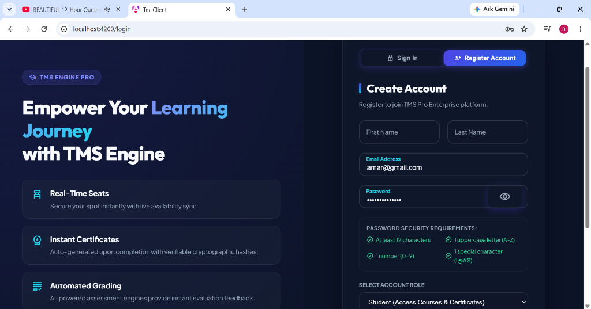
* **Figure 1.1 — Account Registration Interface**: 
  - **Live Password Security Requirements**: Enforces minimum length (12 characters), uppercase letter (`A-Z`), numeric digit (`0-9`), and special symbol (`!@#$%`).
  - **Role Selection**: Configures initial user authorization scopes (`Student`, `Instructor`, or `Admin`).

---

### 1.2 Sign In & JWT Security (`/login` — Sign In Mode)
Registered users authenticate securely via JSON Web Tokens (JWT).

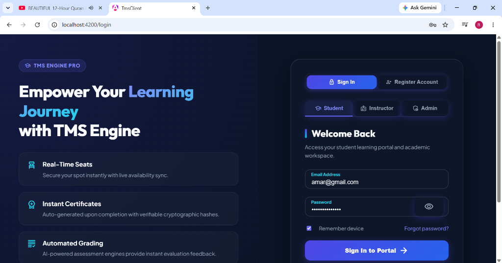
* **Figure 1.2 — Portal Access Interface**:
  - **Quick Role Tabs**: Seamless switching between `Student`, `Instructor`, and `Admin` profiles for rapid evaluation.
  - **JWT Bearer Security**: Returns an encrypted JWT payload containing user role claims and assigned student IDs.

---

## Phase 2: Student Experience & Course Workflows

### 2.1 Real-Time Duplicate Registration Protection (`/enroll`)
To maintain strict data integrity, TMS continuously checks existing enrollment states against candidate requests. If a student attempts to select a course for which they already have an active or pending application, the application wizard immediately halts submission.

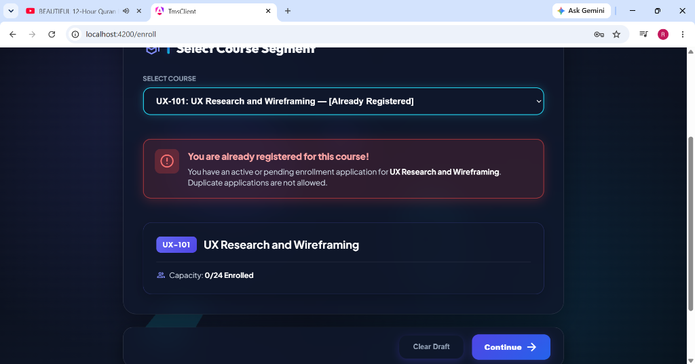
* **Figure 2.1 — Duplicate Registration Warning Banner**:
  - **Dynamic Dropdown Tagging**: Course dropdown labels already registered items with `[Already Registered]`.
  - **Contextual Alert Banner**: Renders an alert stating *"You are already registered for this course! You have an active or pending enrollment application for UX Research and Wireframing. Duplicate applications are not allowed."*
  - **Action Guard**: Prevents duplicate submission by disabling progress buttons.

---

### 2.2 Student Dashboard & Key Performance Indicators (`/dashboard`)
Upon authentication, students are greeted by a personalized control center (`Welcome back, amar jemal`) displaying real-time metrics across academic enrollment, credit limits, and overall GPA calculations.

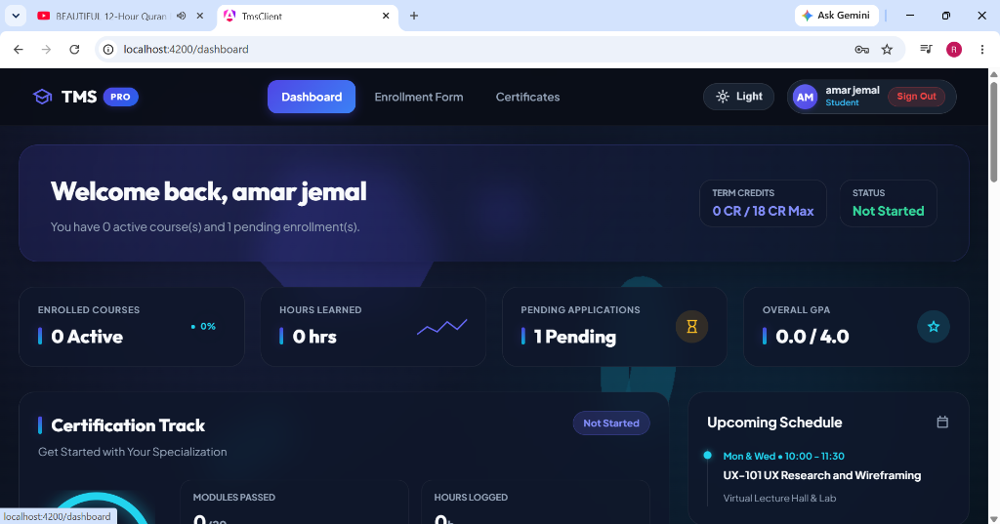
* **Figure 2.2 — Student Dashboard & Status Overview**:
  - **Personalized Header**: Displays dynamic candidate greeting with term credit tracking (`0 CR / 18 CR Max`) and status badge (`Not Started`).
  - **Key Metric Cards**: Real-time summary widgets for **Enrolled Courses** (`0 Active`), **Hours Learned** (`0 hrs`), **Pending Applications** (`1 Pending`), and **Overall GPA** (`0.0 / 4.0`).

---

### 2.3 Certification Track, Live Schedule & Activity Feed
The middle section of the Student Dashboard tracks specialization completion progress alongside live lecture schedules and chronological account audit events.

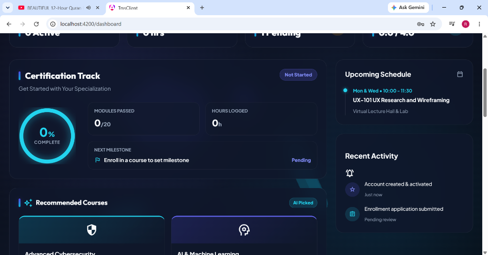
* **Figure 2.3 — Specialization Track & Activity Log**:
  - **Interactive Completion Ring**: Visual progress donut with metrics for **Modules Passed** (`0/20`) and **Hours Logged** (`0h`).
  - **Upcoming Class Schedule**: Live timetable widget displaying upcoming sessions (`Mon & Wed • 10:00 - 11:30 | UX-101 UX Research and Wireframing`).
  - **Recent Activity Feed**: Event notification log tracking account activation and enrollment application submission events.

---

### 2.4 Interactive Course Catalog & Category Filters
Students explore available learning programs using multi-criteria filtering, difficulty toggles, and live text search across 26+ catalog modules.

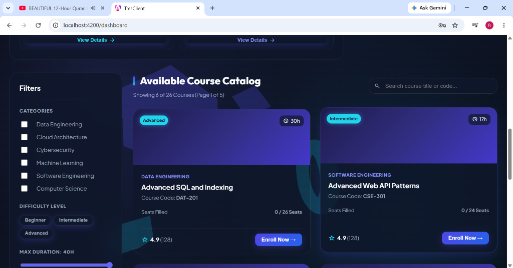
* **Figure 2.4 — Available Course Catalog & Filter Sidebar**:
  - **Multi-Category Filter**: Filter courses by *Data Engineering*, *Cloud Architecture*, *Cybersecurity*, *Machine Learning*, *Software Engineering*, and *Computer Science*.
  - **Difficulty & Duration Controls**: Instant filter badges (*Beginner*, *Intermediate*, *Advanced*) and maximum duration range selector.
  - **Course Info Cards**: Displays category badges, course codes (e.g. `DAT-201`, `CSE-301`), duration, student rating (`4.9 rating`), filled seat capacity (`0 / 26 Seats`), and direct `Enroll Now →` buttons.

---

### 2.5 Catalog Pagination & Multi-Page Navigation
The catalog grid supports smooth pagination across academic course pages with instant UI updates.

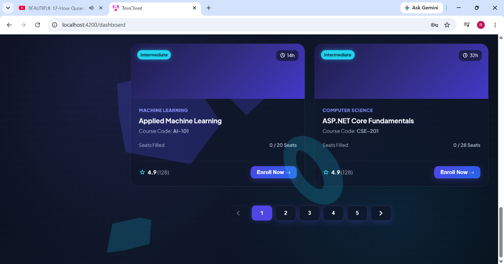
* **Figure 2.5 — Course Catalog Pagination Grid**:
  - **Paginated Navigation**: Seamless page switching (`Page 1 of 5`, showing 6 of 26 courses) with smooth transitions.
  - **Comprehensive Catalog**: Showcases additional courses (*Applied Machine Learning*, *ASP.NET Core Fundamentals*) with instant seat check indicators.

---

## Phase 3: Instructor & Teacher Portal Workflows

### 3.1 Instructor Portal Overview & Metric Widgets (`/instructor`)
Instructors access a central command center displaying high-level metrics for their active teaching load, course rosters, and grading pipeline.

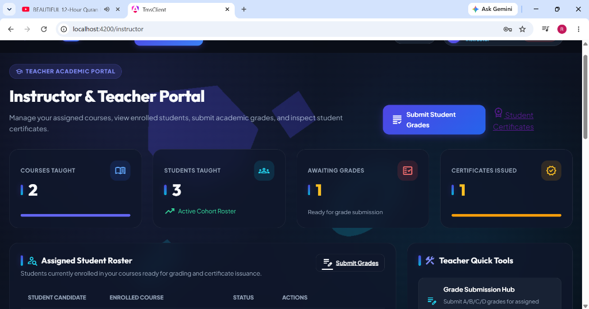
* **Figure 3.1 — Instructor Academic Dashboard**:
  - **Academic KPI Cards**: Tracks **Courses Taught** (`2`), **Students Taught** (`3` active cohort roster), **Awaiting Grades** (`1`), and **Certificates Issued** (`1`).
  - **Action Hub Shortcuts**: Quick access buttons to `Submit Student Grades` and view `Student Certificates`.

---

### 3.2 Assigned Student Roster & Capacity Monitoring (`/instructor`)
Instructors manage course enrollments through a strict role-based access model that isolates approved student candidates from unverified requests.

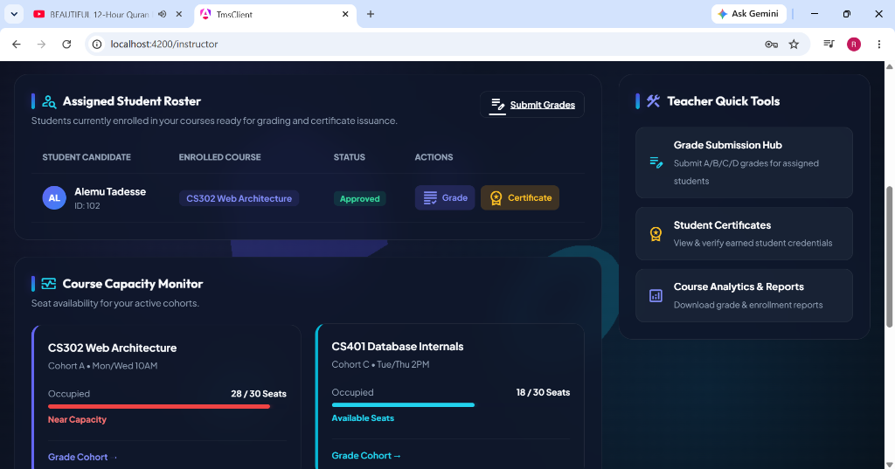
* **Figure 3.2 — Scoped Roster & Course Capacity Monitor**:
  - **Assigned Student Roster**: Displays approved students assigned to instructor courses (*Alemu Tadesse*, Course: `CS302 Web Architecture`, Status: `Approved`). Unapproved/pending student applications are excluded from instructor views until approved by system administrators.
  - **Course Capacity Monitor**: Displays real-time seat occupancy for active cohorts (`CS302 Web Architecture`: 28/30 Seats - Near Capacity; `CS401 Database Internals`: 18/30 Seats - Available Seats).
  - **Teacher Quick Tools**: Direct access menu for Grade Submission Hub, Student Certificates Registry, and Course Analytics & Reports.

---

### 3.3 Class Grade Distribution Analytics (`/instructor`)
The Instructor Portal includes aggregated performance visuals to help faculty analyze grade distributions across active student cohorts.

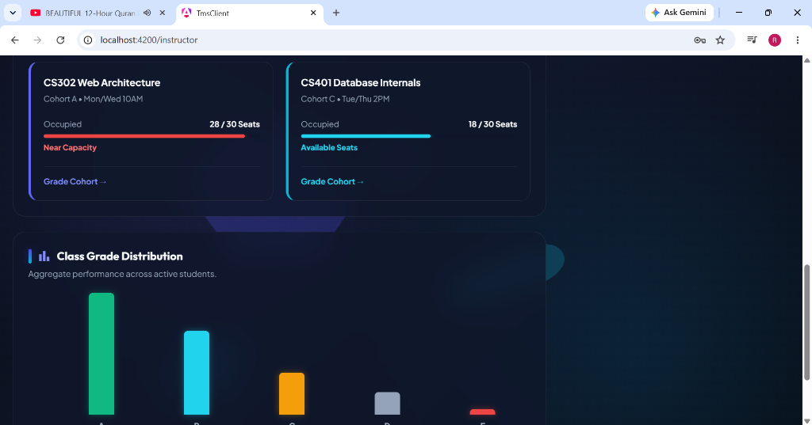
* **Figure 3.3 — Aggregate Grade Performance Bar Chart**:
  - **Grade Spectrum**: Visual performance breakdown across letter grades (A, B, C, D, F) for active course sections.

---

### 3.4 Grade Submission Hub (`/grade-submission`)
Instructors enter, audit, and batch-publish student assessment grades through a dedicated management interface.

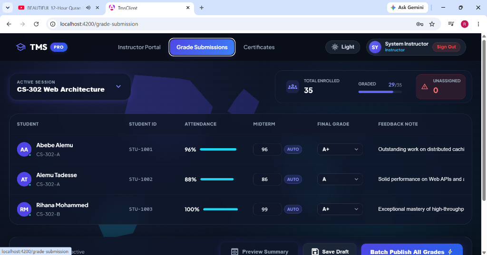
* **Figure 3.4 — Grade Entry & Assessment Management**:
  - **Active Session Selection**: Dropdown menu to filter active course sections (e.g. `CS-302 Web Architecture`).
  - **Session Metrics**: Counters displaying **Total Enrolled** (`35`), **Graded** (`29/35`), and **Unassigned** (`0`).
  - **Assessment Roster**: Detailed grading table with candidate details (*Abebe Alemu*, *Alemu Tadesse*, *Rihana Mohammed*), Student IDs (`STU-1001`, `STU-1002`, `STU-1003`), attendance rates (`96%`, `88%`, `100%`), midterm exam scores, final grade selection (`A+`, `A`), and instructor feedback notes (*"Outstanding work on distributed caching"*, *"Solid performance..."*).
  - **Batch Operations**: Support for `Save Draft`, `Preview Summary`, and `Batch Publish All Grades`.

---

### 3.5 Official Student Certificates Registry (`/certificates`)
Instructors and academic evaluators can inspect and verify official cryptographically linked course completion certificates.

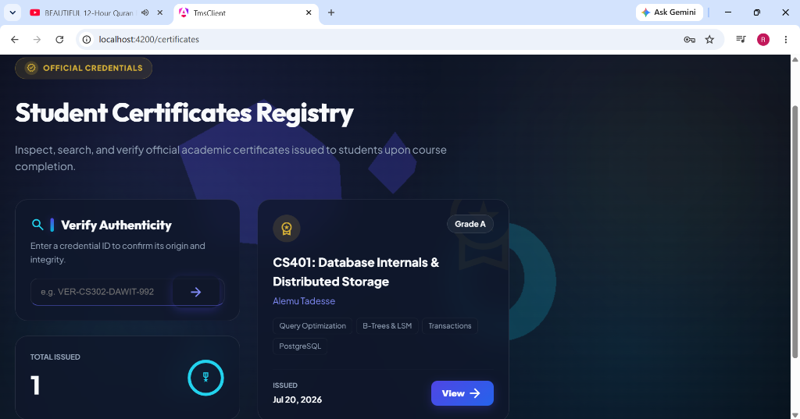
* **Figure 3.5 — Digital Credentials & Verification Registry**:
  - **Authenticity Verification**: Search tool allowing users to enter a credential ID (e.g. `VER-CS302-DAWIT-992`) to confirm certificate origin and validity.
  - **Issued Credentials Summary**: Displays total verified certificates issued (`1 Total Issued`).
  - **Official Certificate Card**: Showcases issued credentials (*Alemu Tadesse* - `CS401: Database Internals & Distributed Storage`, `Grade A`, Issued `Jul 20, 2026`) with direct PDF/Verification view actions.

---

## Phase 4: Administrator Command Center

### 4.1 Administrator Command Center Overview (`/instructor` — Admin View)
System Administrators access an elevated control portal providing institutional governance over courses, enrollment requests, and academic audit trails.

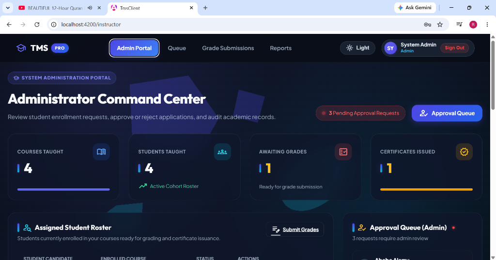
* **Figure 4.1 — Administrator Command Center Dashboard**:
  - **Global System Counters**: Real-time KPI widgets tracking **Courses Taught** (`4`), **Students Taught** (`4`), **Awaiting Grades** (`1`), and **Certificates Issued** (`1`).
  - **Pending Approvals Notification**: High-visibility alert badge displaying `3 Pending Approval Requests` requiring administrative review.
  - **Approval Queue Action**: Direct navigation button to launch the system-wide Approval Queue.

---

### 4.2 System-Wide Enrollment Management Queue (`/enrollments`)
Administrators inspect, review, and process pending student course enrollment applications across all academic cohorts.

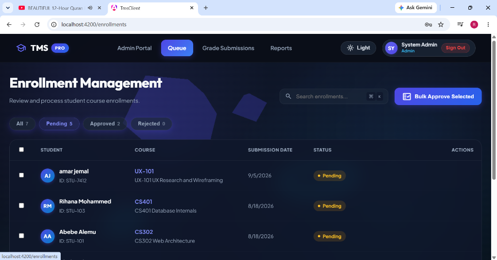
* **Figure 4.2 — Enrollment Management Queue & Batch Approval Workflow**:
  - **Filter Tabs**: Categorized queue views for **All** (`7`), **Pending** (`5`), **Approved** (`2`), and **Rejected** (`0`).
  - **Batch Operations**: Integrated `Bulk Approve Selected` button for multi-candidate processing.
  - **Application Roster**: Detailed queue listing student candidates (*amar jemal*, *Rihana Mohammed*, *Abebe Alemu*), Student IDs (`STU-7412`, `STU-103`, `STU-101`), target courses (`UX-101`, `CS401`, `CS302`), submission timestamps, and current status badges (`Pending`).

---

### 4.3 Administrator Grade Submissions Control (`/grade-submission` — Admin Mode)
System Administrators possess global authorization to inspect, audit, and publish grade rosters across all institutional sections.

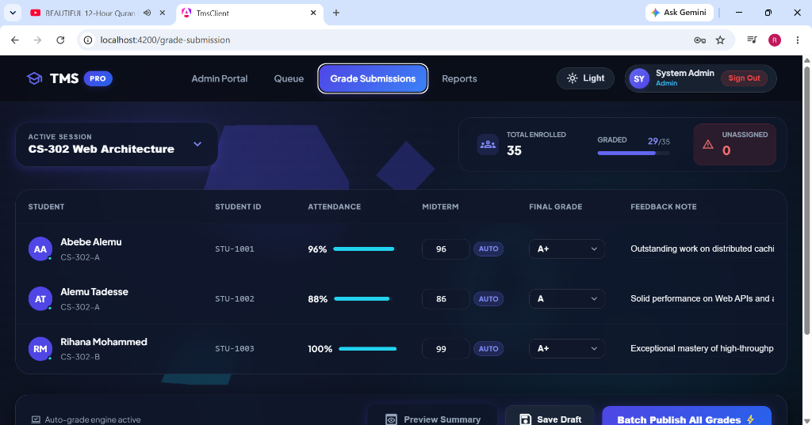
* **Figure 4.3 — Administrator Assessment Override & Audit Interface**:
  - **Institutional Oversight**: Full administrative privileges over active course sections (`CS-302 Web Architecture`).
  - **Audit Counters**: Live progress indicators for enrollment totals (`35 Enrolled`), graded ratios (`29/35 Graded`), and unassigned grade counters (`0 Unassigned`).
  - **Auto-Grade Engine**: Integrated automated grading engine status indicator (`Auto-grade engine active`).

---

### 4.4 Institutional Analytics & Key Performance Summary (`/reports`)
The System Reports hub provides executive-level data visualizations and institutional data export capabilities.

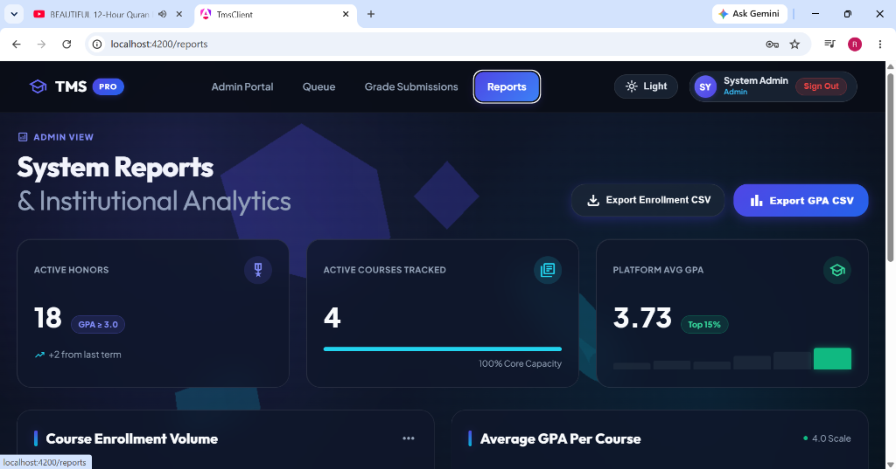
* **Figure 4.4 — System Reports & Institutional Analytics Summary**:
  - **Executive KPI Widgets**: Tracks **Active Honors** (`18` candidates with GPA ≥ 3.0), **Active Courses Tracked** (`4` at 100% Core Capacity), and **Platform Average GPA** (`3.73 / 4.0` — Top 15%).
  - **Institutional Exports**: One-click export triggers for `Export Enrollment CSV` and `Export GPA CSV` files for academic record-keeping.

---

### 4.5 Course Enrollment Volume, GPA Breakdown & Student Assistance (`/reports`)
The reporting engine provides detailed course-level breakdowns and automated student retention tools.

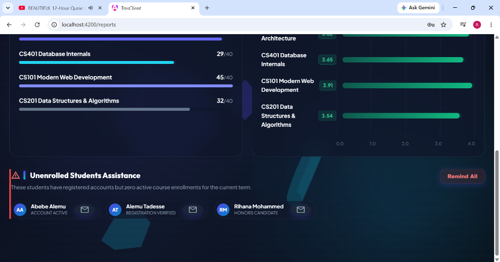
* **Figure 4.5 — Enrollment Volume, Course GPA Distribution & Student Outreach**:
  - **Enrollment Volume Analysis**: Comparative capacity bars for active courses (*CS401 Database Internals* 29/40, *CS101 Modern Web Development* 45/40, *CS201 Data Structures & Algorithms* 32/40).
  - **Average GPA Per Course**: Granular average GPA visualization across courses (ranging from 3.54 to 3.91).
  - **Unenrolled Students Assistance**: Automated retention module identifying registered users without active term enrollments (*Abebe Alemu*, *Alemu Tadesse*, *Rihana Mohammed*) with a one-click `Remind All` email outreach button.

---

## Technology Stack & Architecture

### Frontend (`tms-client`)
* **Framework**: Angular 19+ (Standalone Components)
* **State Management**: NgRx SignalStore (`EnrollmentStore`) & Angular Signals
* **Form Handling**: Reactive Forms & Custom Pattern Validators

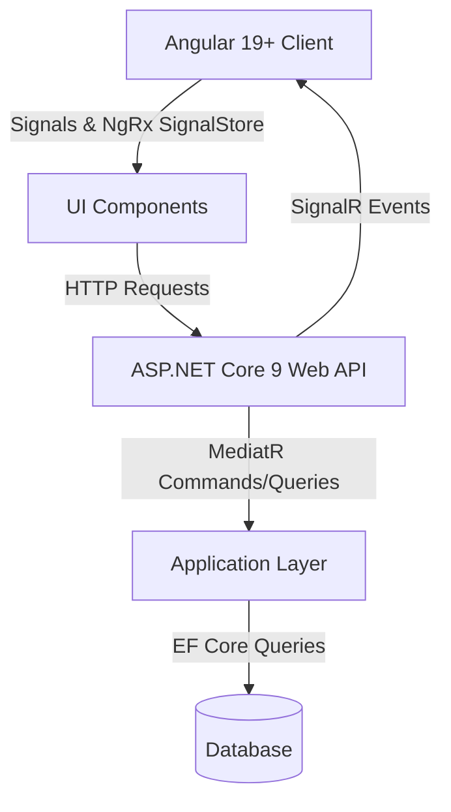

---

## Quick Start & Run Commands

```bash
# 1. Run Frontend (Angular 19)
cd tms-client
npm start
```
